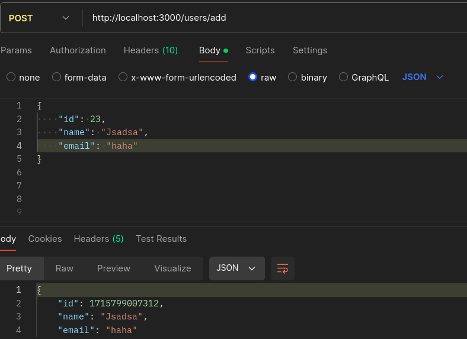
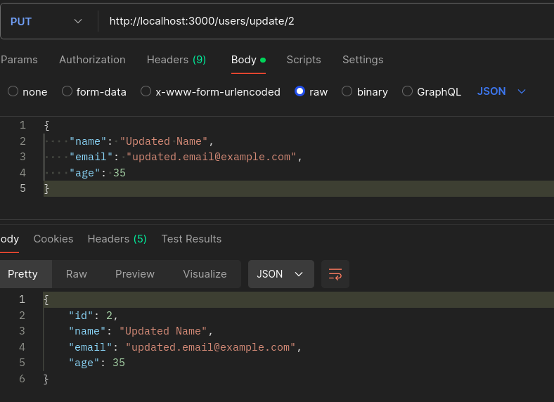

# How it works
### Commnad to run the server

    node server.js

### Explanation

This code sets up a simple HTTP server using Node.js to handle CRUD operations for a collection of users details stored in a JSON file (data.json). This project can perform all the CRUD operations.

1. POST /users/add endpoint:

   *  This endpoint allows clients to add a new blog post.

2. PUT /users/update/:id endpoint:
    * This endpoint allows clients to update an existing blog post specified by its ID.

3. GET /users endpoint:

   * This endpoint allows clients to retrieve all the blog posts.

